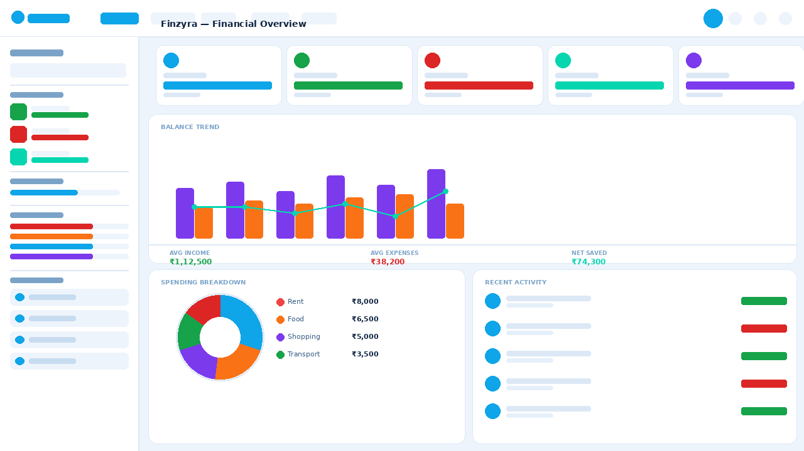
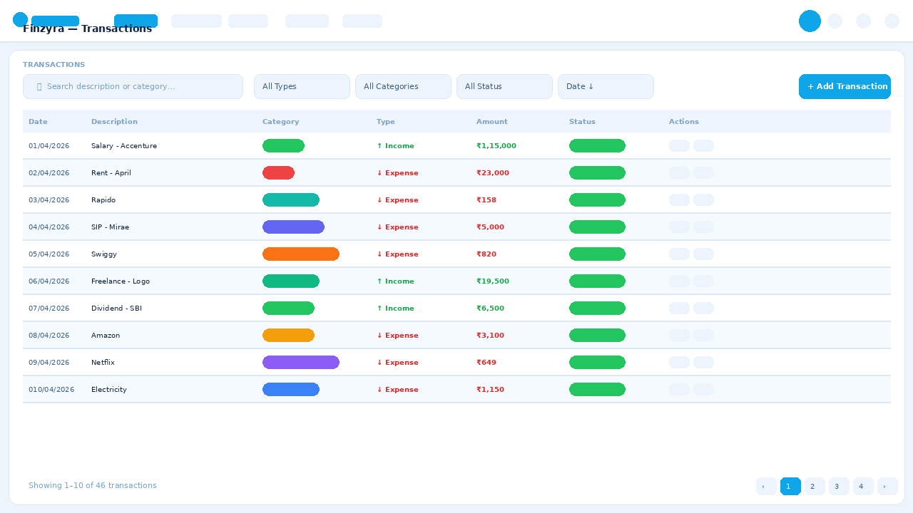
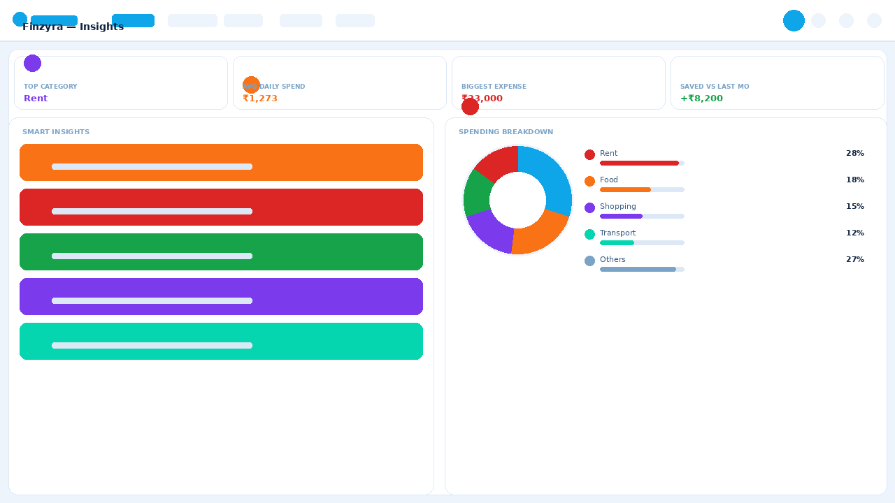
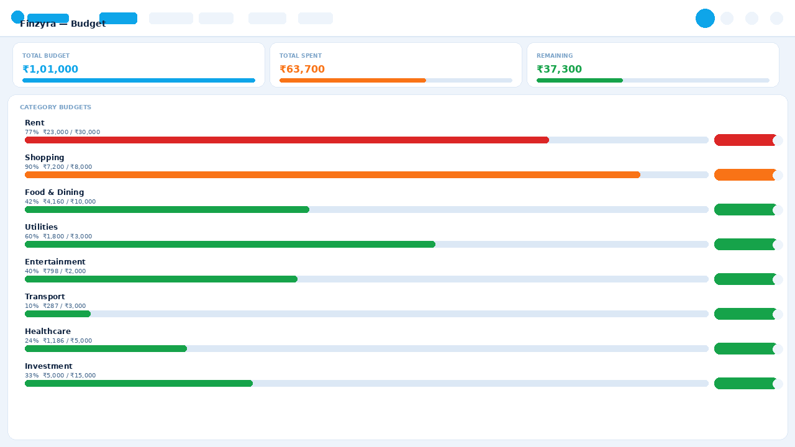
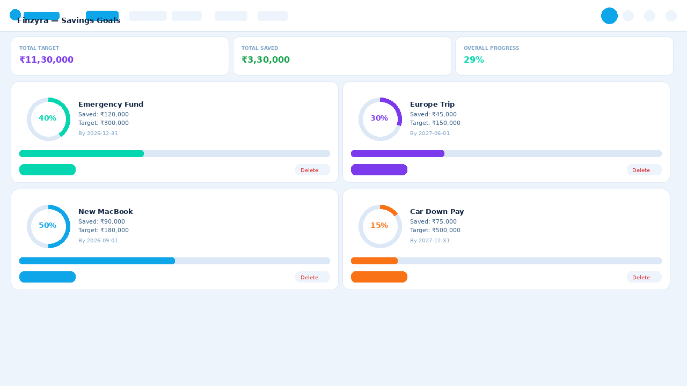

# 💰 Finzyra — Smart Personal Finance Dashboard

> A beautifully designed, fully client-side personal finance tracker built with vanilla HTML, CSS, and JavaScript. No backend. No installation. Just open and use.


---

## 🖼️ Screenshots

### 🏠 Dashboard


### 💳 Transactions


### 🧠 Insights


### 💰 Budget


### 🎯 Goals


---

## 🌟 What is Finzyra?

Finzyra is a personal finance dashboard that helps you take control of your money. It lets you track every rupee coming in and going out, visualize your spending habits, set savings goals, and manage budgets — all from a clean, modern interface that works entirely in your browser.

No server required. No cloud account needed. Your data stays on your device.

---

## ✨ Key Highlights

- 🔐 **Secure Auth** — Sign in / Sign up with password strength validation
- 📊 **Live Dashboard** — Real-time stats with animated charts and left sidebar
- 💳 **Transaction Tracker** — Full history with search, filter, sort and export
- 🎯 **Savings Goals** — Set targets and track progress visually
- 📅 **Budget Manager** — Per-category limits with color-coded alerts
- 🧠 **Smart Insights** — Auto-generated tips based on your spending
- 🌙 **Dark Mode** — Full dark / light theme toggle
- 📱 **Responsive** — Works on desktop, tablet, and mobile
- 💾 **Offline First** — All data saved in your browser's localStorage

---

## 🖥️ Live Demo

**Demo credentials:**
| Field | Value |
|-------|-------|
| Email | demo@finzyra.com |
| Password | Demo@1234 |

---

## 📁 Folder Structure

```
finzyra/
├── index.html            ← Entire app — auth, dashboard, all pages & modals
├── README.md             ← You are here
├── css/
│   ├── style.css         ← Main theme — light blue palette, dark mode, all components
│   └── sidebar.css       ← Dashboard left sidebar + Balance Trend chart styles
├── js/
│   ├── data.js           ← Seed data, constants, localStorage helpers
│   ├── auth.js           ← Sign in / Sign up / Forgot password / Google picker
│   └── app.js            ← Navigation, charts, render functions, modals
└── screenshots/
    ├── 01_dashboard.png
    ├── 02_transactions.png
    ├── 03_insights.png
    ├── 04_budget.png
    └── 05_goals.png
```

---


## 📱 Pages & Features

### 🏠 Dashboard
The main overview screen showing your complete financial picture at a glance.
- **Left Sidebar** — Net worth, this month's income/expenses, savings rate bar, top spending categories, and quick navigation links
- **5 Stat Cards** — Balance, Income, Expenses, Savings Rate, This Month Net
- **Balance Trend Chart** — Bar + line combo chart for 3M or 6M view. Income in purple, expenses in orange, balance as a glowing teal line
- **Spending Breakdown** — Donut chart with per-category percentage breakdown
- **Recent Activity** — Latest 5 transactions with status indicators

### 💳 Transactions
Full transaction history with powerful filtering tools.
- Search by description or category name
- Filter by type (income/expense), category, and status
- Sort by date or amount (ascending or descending)
- Paginated table — 10 rows per page
- Add, edit, delete transactions (Admin role only)
- Export all data to **CSV** or **JSON**

### 🧠 Insights
Automated analysis of your spending patterns.
- 4 summary stat cards
- Category breakdown donut chart
- 5 auto-generated insight cards
- 6-month comparison table

### 💰 Budget
Monthly budget management by category.
- Progress bars for each expense category
- Color-coded status — 🟢 On Track / 🟡 Near Limit / 🔴 Over Budget
- Edit budget limits per category (Admin only)
- Overall budget summary cards at the top

### 🎯 Goals
Visual savings goal tracker.
- Ring-style SVG progress indicators
- Add new goals with name, icon, target amount, and deadline
- Contribute amounts toward any goal
- Deadline countdown with urgency highlights
- Delete completed or cancelled goals (Admin only)

### ⚙️ Settings
- **Theme** — Light or Dark mode
- **Role** — Admin (full access) or Viewer (read-only)
- **Currency** — INR (₹) or USD ($)
- **Date Format** — DD/MM/YYYY or MM/DD/YYYY

---

## 🔐 Authentication

| Feature | Details |
|--------|---------|
| Sign In | Email + password with error messages |
| Sign Up | Live password strength meter with 6 requirements |
| Google Picker | Demo Google account selector (3 accounts) |
| Forgot Password | Demo reset flow |
| Auto Login | Session saved — stays logged in on refresh |
| Sign Out | Clears session and returns to login |

---

## 👤 Roles

| Role | Access |
|------|--------|
| **Admin** | Full access — add, edit, delete transactions, edit budgets, manage goals |
| **Viewer** | Read-only — all add/edit/delete buttons are hidden |

---

## 💾 Data Storage

| Key | What it stores |
|-----|---------------|
| `fz3_tx` | All transactions |
| `fz3_budgets` | Budget limits per category |
| `fz3_goals` | Savings goals |
| `fz3_users` | Registered user accounts |
| `fz3_session` | Currently logged-in user |
| `fz3_settings` | Theme, currency, date format |
| `fz3_role` | Current role (admin or viewer) |

---

## 🎨 Design System

- **Font:** Sora + JetBrains Mono
- **Primary:** Sky blue `#0ea5e9`
- **Accent:** Teal `#06d6b0`
- **Charts:** Chart.js 4.4.1
- **Icons:** Inline SVG

---

## 🌐 Deploy to GitHub Pages

1. Push the `finzyra` folder to GitHub
2. Go to repo → **Settings** → **Pages**
3. Source: `main` branch → `/ (root)` → **Save**
4. Live at: `https://YOUR-USERNAME.github.io/finzyra`

---

## 🛠️ Tech Stack

| Technology | Usage |
|------------|-------|
| HTML5 | App structure |
| CSS3 | Theme, animations, dark mode |
| Vanilla JavaScript | All logic — no frameworks |
| Chart.js 4.4.1 | Charts and graphs |
| localStorage | Data persistence |

---

*Built with ❤️ — Finzyra helps you spend smarter and save better.*
